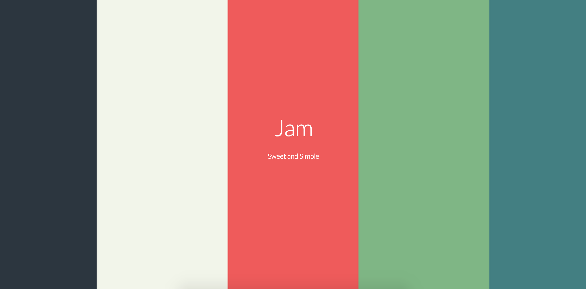

## Getting Started

Simply install Jam via NPM and make sure that React and React-Dom is installed :

```
npm install jam-components --save
```

Then Import the part you'd like to use:

```
Import React from 'react';
Import { Button } from 'jam-components';
```

## Docs

Check out the docs [here!](https://awaseem.github.io/Jam/)

## Thank you

This is not possible without the amazing Skeleton CSS framework and anime.js! 
if you like this component library be sure to check them out [here](http://getskeleton.com/) and [here](http://anime-js.com/)!
